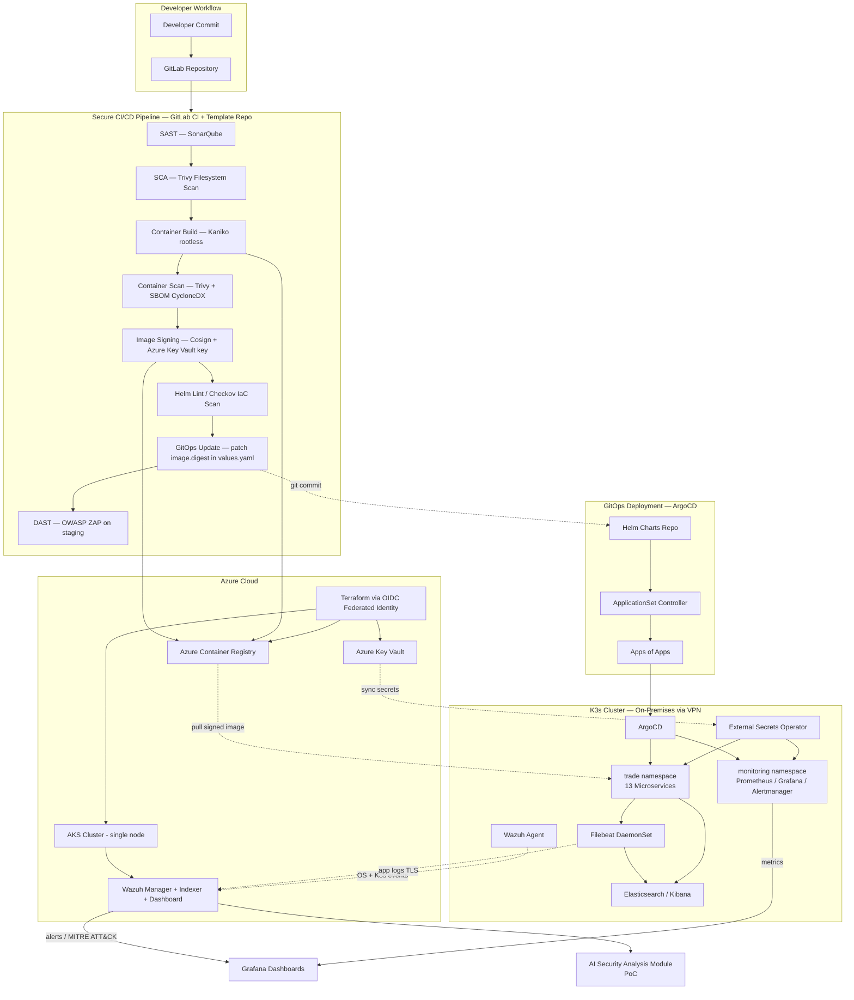
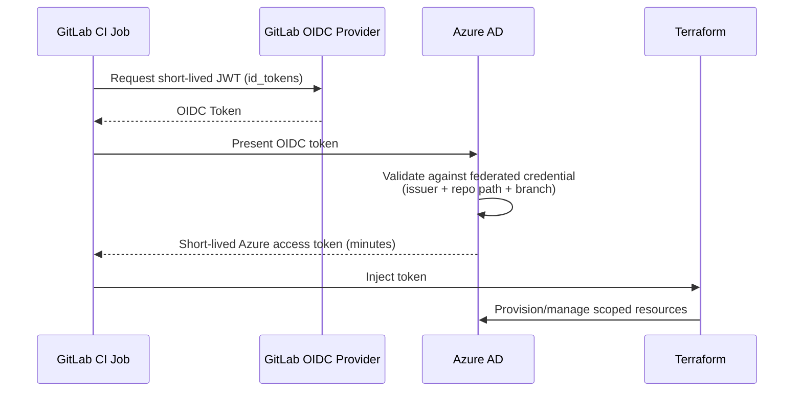
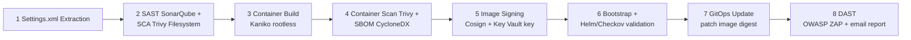
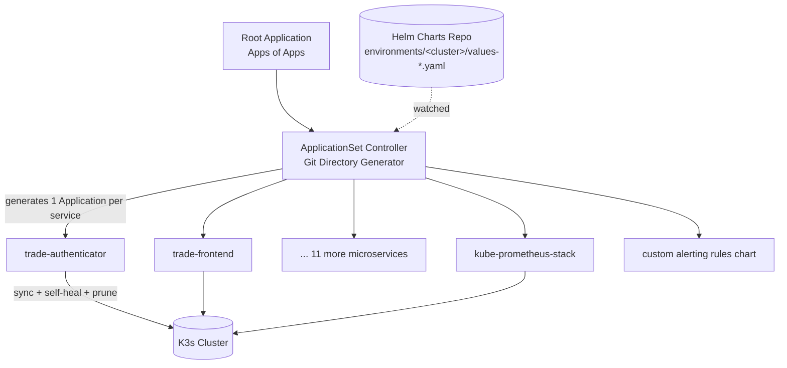
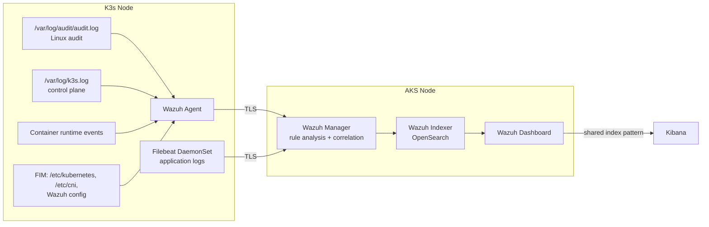
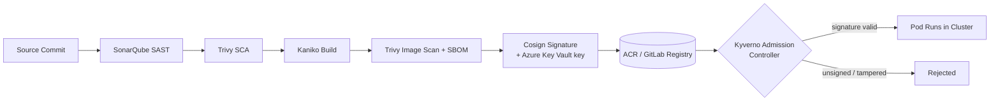

# Secure, Scalable & Intelligent DevSecOps Platform

**Hybrid Cloud DevSecOps Platform for a Trade Finance Application**

---

## 1. Overview

This platform delivers a **cloud-agnostic, security-first DevSecOps pipeline** for a Trade Finance application composed of **13+ Spring Boot / Angular microservices**, deployed across a **hybrid Kubernetes environment** (Azure AKS + on-prem K3s).

"Cloud agnostic" here means no proprietary cloud API sits in the critical path: every deployment artifact is a standard Kubernetes manifest or Helm chart, every infrastructure resource is provisioned through vendor-neutral Terraform modules, and every secret is injected at runtime through the External Secrets Operator — an open standard. Swapping AKS for GKE, EKS, or on-prem Kubernetes would require only a Terraform provider swap; the pipelines, GitOps workflow, security gates, and observability stack stay unchanged.

The platform was delivered across **three Agile releases**, following a release-based Scrum methodology aligned with the DevSecOps infinity loop (Shift Left + Shift Right):

| Release | Focus | Key Deliverables |
|---|---|---|
| **Release 1** | Infrastructure & Cloud Foundation | Terraform IaC, OIDC federated identity, Azure Key Vault, External Secrets Operator, Checkov |
| **Release 2** | CI/CD Pipeline & GitOps | Template repository, Kaniko builds, SonarQube/Trivy/Cosign, ArgoCD, reusable Helm chart |
| **Release 3** | Observability & Security Monitoring | Prometheus/Grafana, ELK, Wazuh SIEM, AI-assisted security analysis (PoC) |

---

## 2. Global Architecture

The platform is structured around **four functional layers** covering the full application lifecycle, from code commit to runtime monitoring:

1. **Infrastructure Layer** — Terraform-provisioned Azure resources + hybrid Kubernetes clusters
2. **Secure Delivery Layer** — GitLab CI/CD with embedded SAST/SCA/IaC/DAST security gates and supply-chain integrity (Cosign, SBOM)
3. **GitOps Deployment Layer** — ArgoCD pull-based reconciliation with Apps-of-Apps / ApplicationSet pattern
4. **Observability & Security Layer** — Prometheus/Grafana metrics, ELK logs, Wazuh SIEM, and an exploratory AI-driven security analysis module

> **Two-cluster split.** AKS (single node, Azure student subscription) hosts the Wazuh SIEM stack (manager, indexer, dashboard) so that a compromised application pod on K3s cannot interfere with the security-detection layer that watches it. K3s (single node, on-prem, VPN-only API server) is the application deployment target: it runs the 13 Trade Finance microservices, ArgoCD, the External Secrets Operator, Kafka, Prometheus/Grafana/Alertmanager, and the Filebeat/Wazuh-agent log shippers. Both clusters run the same standard Kubernetes APIs, so Helm charts and manifests are fully portable between them, and the design assumes multi-node operation even though both currently run as single nodes for cost reasons.

---

## 3. Infrastructure Layer (Release 1)

### 3.1 Design Principles
- **Cloud agnosticism** — every Azure resource goes through a vendor-neutral Terraform module; no direct Azure SDK calls from the pipeline.
- **Least privilege** — every IAM role, service account, and network rule grants only the minimum permissions required, enforced manually at design time and automatically via Checkov on every pipeline run.
- **Reproducibility** — `terraform apply` on a clean subscription reproduces the current state exactly, with no manual console steps.

### 3.2 Terraform Module Structure

| Module | Responsibility | Key Resources |
|---|---|---|
| `module/aks` | AKS cluster provisioning | AKS cluster, node pools, managed identity, RBAC, Azure CNI |
| `module/networking` | Network foundation | VNet, subnets, NSGs, route tables, private DNS |
| `module/acr` | Container registry | ACR, access policies (admin account disabled) |
| `module/vault` | Secret management foundation | Azure Key Vault, soft delete, purge protection, private endpoint |

### 3.3 Pipeline Authentication — OIDC Federated Identity

GitLab CI never stores a long-lived Azure service principal secret. Instead:

The Azure AD application is scoped to the **Contributor** role on the project's resource group only (not the subscription), and the federated credential's subject-claim filter restricts token acceptance to the designated repository's `main` branch. If pipeline logs leaked entirely, there would be no reusable credential to extract.

### 3.4 Secret Management

- **Azure Key Vault** centralizes DB credentials, API keys, certificates, and registry tokens — never stored in Git or pipeline variables. Soft delete + purge protection enabled.
- **External Secrets Operator (ESO)**, deployed on both AKS and K3s, syncs Key Vault secrets into native Kubernetes `Secret` objects via `ExternalSecret` custom resources managed through GitOps. The pipeline never touches secret values — only references. ESO also handles automatic rotation: a secret changed in Key Vault propagates into the cluster without redeployment.

### 3.5 K3s Security Configuration
- RBAC enabled by default, managed declaratively via GitOps/ArgoCD.
- Network Policies enforced via Flannel (pod-level isolation).
- API server reachable only over VPN — never exposed to the public internet.

---

## 4. Secure CI/CD & GitOps Layer (Release 2)

### 4.1 Template Repository Pattern

Rather than 13 independent `.gitlab-ci.yml` files duplicating the same security logic, a **centralized Security and Template Repository** (`Trade-Template`) holds every reusable pipeline template, Dockerfile, and scanning script. Application repositories `include` the templates by project reference and override only service-specific variables (name, port, language version, SonarQube key). A security update to one template propagates to all 13 services on the next pipeline run.

### 4.2 Eight-Stage Pipeline

Each stage gates the next — a failure blocks the artifact from progressing.

1. **Settings.xml extraction** — Maven credentials pulled from a protected CI variable, never committed.
2. **SAST + SCA (parallel)** — SonarQube (auto-detects Java/Node via `pom.xml`/`package.json`, waits on Quality Gate) and Trivy filesystem scan against declared dependencies.
3. **Container build** — Kaniko builds inside an unprivileged pod (no Docker daemon, no host socket) and pushes simultaneously to GitLab Registry and Azure Container Registry.
4. **Container scan + SBOM** — Trivy scans every image layer and generates a CycloneDX SBOM, stored as a pipeline artifact for forensic traceability.
5. **Image signing** — Cosign signs the image with a key in Azure Key Vault. A Kyverno admission policy rejects any unsigned image at the cluster boundary.
6. **Bootstrap & Helm validation** — Registry pull secret managed as a GitOps PreSync hook; Checkov validates raw Helm chart sources.
7. **Deployment validation & GitOps update** — Helm lint + template render (Checkov re-validates rendered manifests) → the pipeline patches the immutable **SHA256 image digest** into the service's `values.yaml` in the Helm charts repo. This Git commit is what ArgoCD reconciles on (typically within 3 minutes).
8. **DAST** — OWASP ZAP scans the deployed staging endpoint (passive + active). `patch_spec.py` feeds ZAP the live OpenAPI spec for API services. Critical/high findings fail the pipeline; all findings are emailed to the security team regardless.

### 4.3 Container Hardening

| Base Image Strategy | Used For | Rationale |
|---|---|---|
| `gcr.io/distroless/java17-debian12:nonroot` | Java 17 services | No shell, no package manager, runs as UID 65532 — satisfies the "no root" admission policy |
| `nginx:stable-alpine3.19` | Angular frontend | Minimal Alpine image; final image contains only Nginx + compiled static assets, no Node.js/npm |

Both Dockerfiles are multi-stage builds; only compiled artifacts cross into the runtime stage.

### 4.4 GitOps Deployment — ArgoCD

- **ApplicationSet + Git directory generator**: onboarding a new service = adding a config directory + values file; the `Application` resource is generated automatically.
- **Apps of Apps**: one root Application manages the ApplicationSet, which manages every other Application — a fully GitOps-managed hierarchy after initial bootstrap.
- **Automated sync, prune, self-heal**: ArgoCD continuously reconciles declared vs. actual state; unauthorized manual changes are automatically reverted.
- **Two-Application pattern for monitoring**: the upstream `kube-prometheus-stack` chart plus a separate custom-rules chart, both GitOps-managed.

### 4.5 Reusable Helm Chart

One shared chart (Deployment, Service, Ingress, ServiceMonitor, HPA) serves all 13 microservices. Per-service customization lives entirely in each service's `values.yaml`, including the pipeline-injected immutable image digest. Namespaces separate concerns: `trade` (business microservices), `monitoring` (Prometheus/Grafana/Alertmanager), `wazuh` (SIEM), plus infra-tooling namespaces (ArgoCD, ESO).

---

## 5. Observability & Security Monitoring Layer (Release 3)

### 5.1 Three Pillars

| Pillar | Question Answered | Stack |
|---|---|---|
| **Metrics** | Is the system healthy right now? | Prometheus + Grafana + Alertmanager (`kube-prometheus-stack`, K3s, `monitoring` namespace) |
| **Logs** | What happened, and when? | Filebeat (DaemonSet on K3s) → Elasticsearch → Kibana |
| **Security Events** | Is the system under threat? | Wazuh SIEM (manager/indexer/dashboard on AKS) — intrusion detection, FIM, PCI DSS / GDPR compliance rules |

Every component is self-hosted, vendor-neutral (no Azure Monitor dependency), and deployed via Helm charts declared as ArgoCD Applications — extending the GitOps audit trail to the observability layer itself.

### 5.2 Metrics — Prometheus / Grafana

- `kube-prometheus-stack` on K3s: 30-day retention, 10 GiB persistent volume, 15s global scrape interval (60s for high-cardinality targets like Kafka).
- **ServiceMonitor / PodMonitor CRDs**: each of the 13 microservices exposes Spring Boot Actuator metrics at `/actuator/prometheus`; the shared Helm chart includes a conditional `ServiceMonitor` scoped to the `trade` namespace via `namespaceSelector`. The Prometheus Operator auto-discovers new targets within ~30 seconds — no manual reload.
- Grafana connects to Prometheus over the internal cluster network only (no external exposure).

### 5.3 Logs — Filebeat / Elasticsearch / Kibana

Filebeat runs as a DaemonSet on K3s, collecting container log streams and forwarding them to Elasticsearch for indexing and Kibana visualization.

### 5.4 Security — Wazuh SIEM

The Wazuh agent watches OS/K8s-level events (audit logs, K3s control-plane logs, container runtime lifecycle, file integrity monitoring on `/etc/kubernetes`, `/etc/cni`, and Wazuh's own config). Filebeat separately ships application-level container logs. Both channels transmit over TLS to the Wazuh Manager on AKS, which correlates events, applies detection rules, evaluates PCI DSS / GDPR compliance, and forwards processed data to the Indexer. End-to-end latency from event generation to dashboard visualization is typically a few seconds. The dashboard shows alert volume, severity distribution, top triggered rules, MITRE ATT&CK tactic/technique mapping, and compliance status, with drill-down into raw log context via a shared Kibana index pattern.

### 5.5 AI-Assisted Security Analysis (Proof of Concept)

A preliminary, exploratory script sits on top of the unified metrics/logs/security data layer to surface vulnerability insights. It is **not** a production behavioral-anomaly detector yet — a full AI-driven module (unusual authentication patterns, unexpected network connections, resource-usage spikes, prioritized Grafana recommendations) is scoped as future work, not a shipped capability.

---

## 6. Supply Chain Integrity — End-to-End Trust Chain

Only images that carry a valid Cosign signature — produced after passing every prior gate — are admitted to the cluster. This establishes a verifiable chain of trust from source commit to running workload.

---

## 7. Namespace Isolation Strategy

| Namespace | Cluster | Contents |
|---|---|---|
| `trade` | K3s | 13 Trade Finance microservices |
| `monitoring` | K3s | Prometheus, Grafana, Alertmanager, Prometheus Operator |
| `argocd` | K3s | ArgoCD API server, repo server, application controller, ApplicationSet controller |
| `wazuh` | AKS | Wazuh manager, indexer, dashboard |
| ESO (per-cluster) | AKS + K3s | External Secrets Operator controllers |

Namespace separation enforces least privilege, limits blast radius of a compromised workload, and simplifies monitoring and access control.

---

## 8. Technology Stack Summary

| Layer | Tools |
|---|---|
| IaC | Terraform, Checkov |
| Identity | OIDC Federated Identity (GitLab ↔ Azure AD) |
| Secrets | Azure Key Vault, External Secrets Operator |
| CI/CD | GitLab CI, Kaniko |
| SAST / SCA | SonarQube, Trivy |
| Supply Chain | Cosign, SBOM (CycloneDX), Kyverno admission control |
| DAST | OWASP ZAP |
| GitOps | ArgoCD (ApplicationSet, Apps of Apps) |
| Packaging | Helm (single reusable chart) |
| Policy as Code | OPA Gatekeeper |
| Metrics | Prometheus, Grafana, Alertmanager |
| Logs | Filebeat, Elasticsearch, Kibana |
| SIEM | Wazuh |
| Compute | Azure AKS (single node), K3s (single node, on-prem, VPN) |
| Registries | Azure Container Registry, GitLab Container Registry |

---

## 9. Notes & Scope Boundaries

- Both Kubernetes clusters currently run as **single-node** setups for cost reasons under an academic subscription; the namespace strategy, Network Policies, RBAC, and GitOps model are designed to work identically at multi-node scale.
