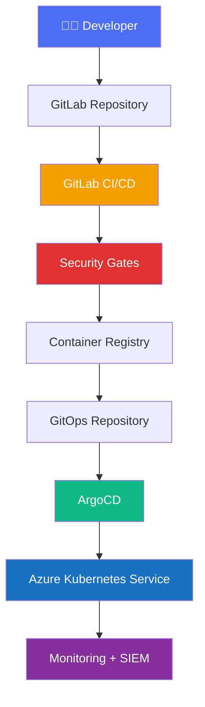
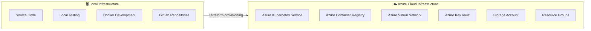
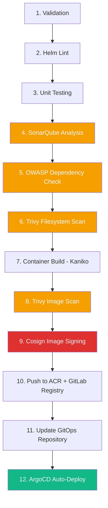
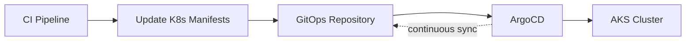
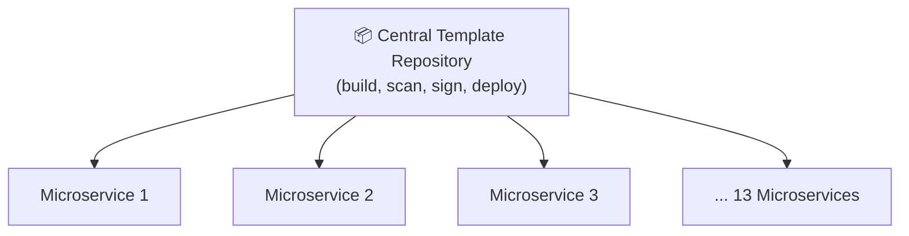
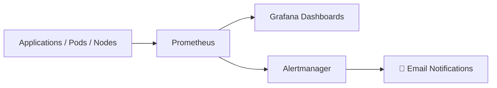

# Enterprise Cloud-Native DevSecOps Platform

**Secure · Automated · Scalable · Observable**

> **Confidentiality note:** the implementation source code is not published due to confidentiality agreements. This repository documents the architecture, workflows, dashboards, and engineering practices behind the platform.

## Overview

This project shows how modern software delivery can be secured by weaving security controls into the CI/CD pipeline itself, on top of cloud-native infrastructure and GitOps principles. Every application built on the platform is continuously scanned, validated, signed, deployed, monitored, and audited — automatically, on every commit.

## Objectives

- Secure software delivery
- Infrastructure automation (IaC)
- GitOps-based deployment
- Continuous vulnerability scanning
- Container image signing
- Continuous monitoring & centralized SIEM
- Cloud-native, hybrid deployment model
- Reusable, centralized CI/CD templates

---

## Solution Architecture

*(Full detailed architecture diagram: `docs/architecture/architecture-overview.png`)*

---

## Hybrid Infrastructure

The platform splits responsibilities across a local development environment and a fully automated Azure cloud environment.

- **Local:** development, testing, and source control — developers only interact with GitLab.
- **Cloud (Azure):** production infrastructure, fully provisioned via **Terraform**, isolated from local development.

---

## Separation of Concerns

| Component | Responsibility |
|---|---|
| GitLab Repository | Source code management |
| GitLab CI/CD | Build & security automation |
| Azure Container Registry | Container image storage |
| GitLab Registry | Internal image registry |
| GitOps Repository | Kubernetes manifests |
| ArgoCD | Continuous deployment |
| AKS | Application hosting |
| Terraform | Infrastructure provisioning |
| Prometheus | Metrics collection |
| Grafana | Visualization |
| Alertmanager | Notifications |
| Wazuh | SIEM & threat detection |

Each component owns exactly one responsibility, keeping the platform easy to maintain and scale.

---

## CI/CD Pipeline

Fully automated with GitLab CI — every commit triggers the complete DevSecOps pipeline end to end.

---

## Integrated Security

Security controls are layered throughout the pipeline — only verified, signed images are eligible for deployment.

| Layer | Tool |
|---|---|
| Static Application Security Testing (SAST) | SonarQube |
| Dependency Analysis (SCA) | OWASP Dependency Check |
| Filesystem Scanning | Trivy (filesystem mode) |
| Container Image Scanning | Trivy (image mode) |
| Image Integrity & Signing | Cosign |

---

## GitOps Deployment

Deployments never happen directly from the CI pipeline. Instead, the pipeline updates a GitOps repository, and **ArgoCD** takes over from there — continuously reconciling the cluster state with the desired state in Git.

This model improves:

- Traceability
- Rollback capability
- Auditability
- Deployment consistency

---

## Centralized CI/CD Templates

To avoid duplicating pipeline logic across microservices, all common CI/CD jobs live in a dedicated **template repository**. Each microservice simply includes the shared templates.

**Benefits:** single source of truth · reduced duplication · easier maintenance · consistent pipelines · faster onboarding · simplified platform-wide updates.

---

## Kubernetes Platform

Applications run on **Azure Kubernetes Service**, hosting:

- 13 microservices
- Namespaces, Services, Deployments, Ingress
- Secrets & ConfigMaps
- Network Policies

Supporting high availability, self-healing, horizontal scaling, and rolling updates.

---

## Monitoring & Observability

- **Prometheus** — collects metrics from Kubernetes, containers, and applications.
- **Grafana** — dashboards for CPU, memory, pods, nodes, requests, and application metrics.
- **Alertmanager** — sends automated email notifications on triggered alert rules.

---

## Security Monitoring (SIEM)

**Wazuh** acts as the platform's centralized SIEM, providing:

- Log aggregation
- Threat detection
- Vulnerability monitoring
- Security event correlation
- Incident investigation

This extends security visibility beyond the CI/CD pipeline into runtime operations.

---

## Screenshots

Dashboards available in this repository:

`GitLab Pipeline` · `SonarQube` · `Dependency Check` · `Trivy` · `Azure Container Registry` · `GitLab Registry` · `ArgoCD` · `AKS` · `Prometheus` · `Grafana` · `Alertmanager` · `Wazuh`

## Documentation

- Architecture diagrams — `docs/architecture/`
- Technical report
- Graduation presentation

---

## Technology Stack

| Category | Technologies |
|---|---|
| Cloud | Microsoft Azure |
| Kubernetes | AKS |
| CI/CD | GitLab CI |
| IaC | Terraform |
| GitOps | ArgoCD |
| Containers | Docker, Kaniko |
| Registries | Azure Container Registry, GitLab Registry |
| Security | SonarQube, Trivy, OWASP Dependency Check |
| Image Signing | Cosign |
| Monitoring | Prometheus |
| Visualization | Grafana |
| Alerting | Alertmanager |
| SIEM | Wazuh |

---

## Key Achievements

- Enterprise-grade DevSecOps platform
- Infrastructure as Code across a hybrid environment
- GitOps-driven, auditable deployments
- Security embedded at every pipeline stage
- Cosign-based container image signing
- Centralized, reusable CI/CD templates
- Kubernetes orchestration at scale
- Continuous monitoring and SIEM integration

---

## Confidentiality Notice

The implementation source code is not publicly available due to confidentiality and intellectual property restrictions. This repository exists to showcase the architecture, engineering practices, infrastructure design, and DevSecOps workflow developed during this graduation project.